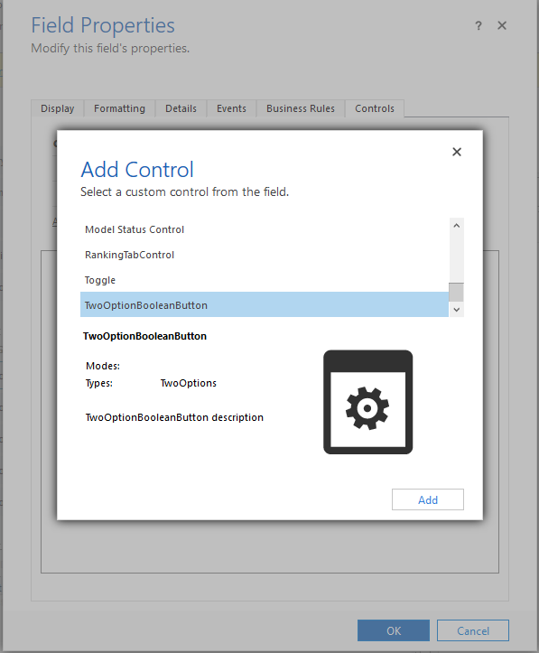
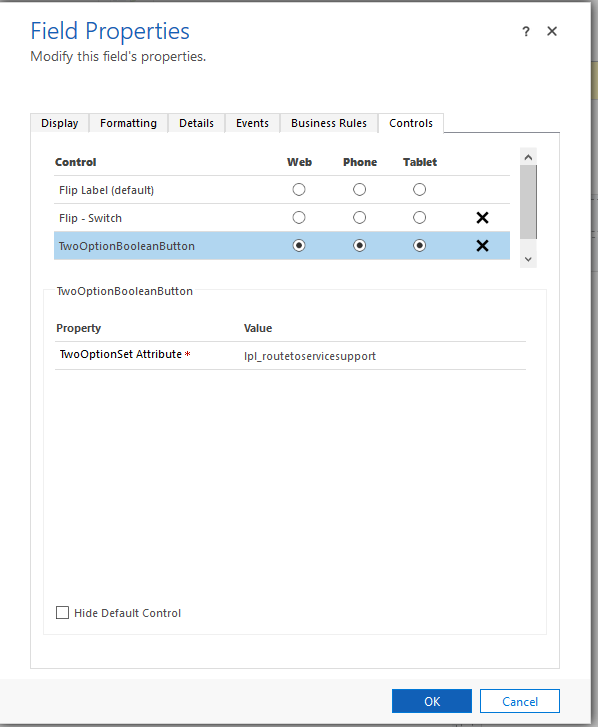
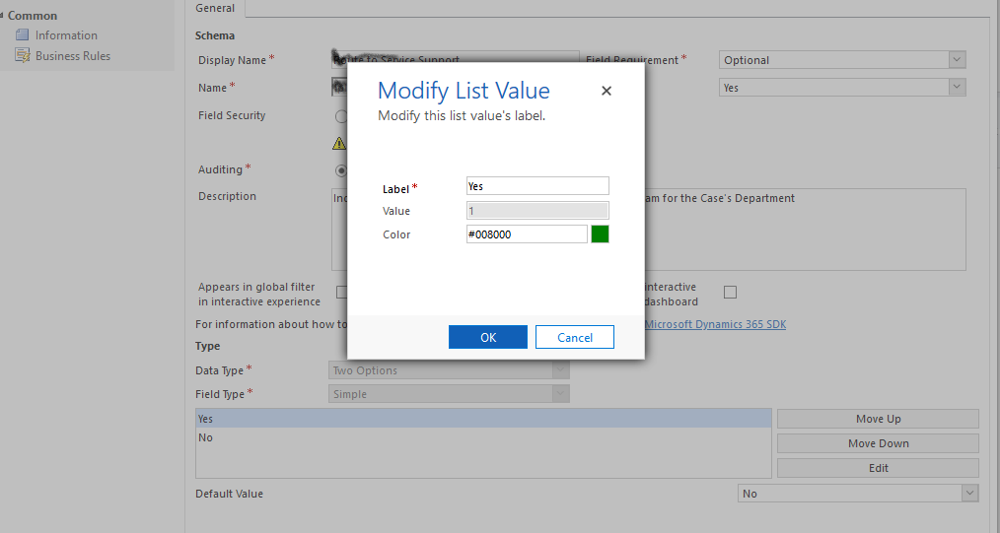

# TwoOptionButton
Two Option Button

## Control Overview
This control is a TwoOption control for model driven app (D365), which will display the true/false options as clickable buttons with colorful background set for the options inside twooption field. It is best works for two option data type fields with color coding. This control dynamically sets the buttons based on options in two optionset attribute.

## Install
 - Download the latest version of the solution from solution folder 
 - Import the solution to your Dynamics 365 instance
 
 ## Control Registration Steps 
 - After import of the control the control is available in the list of available controls

## OptionSet Color Configuration
To set the color of the two optionset buttons configure the color in the two optionset attribute

